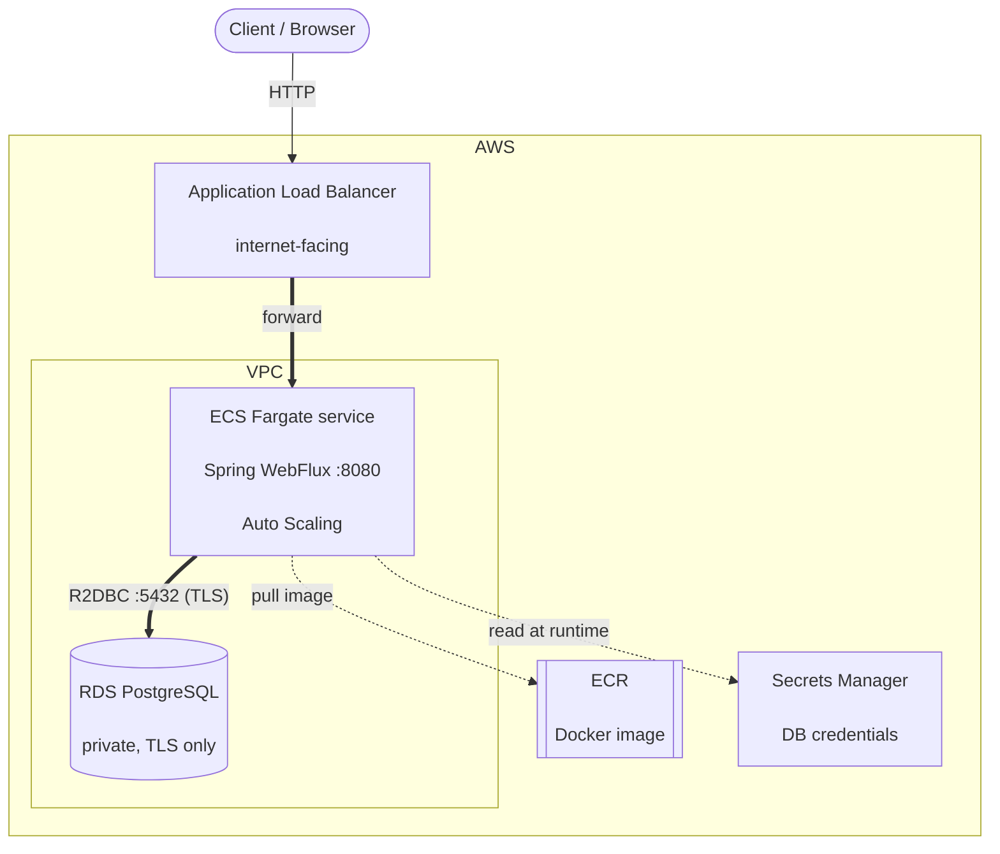
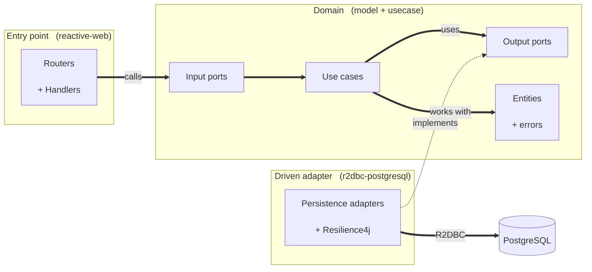

# Franchise Management API

Reactive REST API to manage a network of commercial franchises, their branches and the
products of each branch. Built with Spring WebFlux, Java 17 and R2DBC over PostgreSQL,
following the Bancolombia Clean Architecture (hexagonal) scaffold.

## Features

- Nine reactive endpoints covering franchises, branches and products.
- Report of the highest-stock product per branch within a franchise.
- Non-blocking end to end (Spring WebFlux + R2DBC).
- Resilience patterns on database calls: Circuit Breaker, Time Limiter and Retry (Resilience4j).
- Interactive API documentation with Swagger UI (springdoc-openapi).
- Infrastructure as Code (Terraform) to deploy on AWS ECS Fargate.

## Tech stack

| Area | Technology |
|------|------------|
| Language | Java 17 |
| Web | Spring WebFlux (RouterFunction + Handlers) |
| Persistence | Spring Data R2DBC + PostgreSQL |
| Resilience | Resilience4j |
| Build | Gradle (multi-module) |
| Testing | JUnit 5, Mockito, Reactor StepVerifier, JaCoCo |
| Docs | springdoc-openapi (Swagger UI) |
| Container | Docker (multi-stage) |
| Cloud | AWS ECS Fargate, ECR, RDS, ALB, Secrets Manager (Terraform) |

## Architecture

### Cloud infrastructure (AWS)

The application runs as an ECS Fargate service behind an Application Load Balancer. The
container image is stored in ECR, database credentials in Secrets Manager, and data in an
RDS PostgreSQL instance. Everything is provisioned with Terraform.



### Application (Hexagonal / Clean Architecture)

Dependencies point inward: infrastructure depends on the domain, never the other way around.
The domain has no Spring, persistence or HTTP dependencies.



## API

| Operation | Method & path | Success |
|-----------|---------------|---------|
| Create franchise | `POST /api/franchises` | 201 |
| Add branch to a franchise | `POST /api/branches` | 200 |
| Add product to a branch | `POST /api/products` | 200 |
| Remove a product | `DELETE /api/products/{productId}` | 200 |
| Update product stock | `PATCH /api/products/{productId}/stock` | 200 |
| Highest-stock product per branch | `GET /api/franchises/{franchiseId}/highest-stock-products` | 200 |
| Update franchise name | `PATCH /api/franchises/{franchiseId}/name` | 200 |
| Update branch name | `PATCH /api/branches/{branchId}/name` | 200 |
| Update product name | `PATCH /api/products/{productId}/name` | 200 |

Interactive documentation with request/response schemas and examples is available once the
application is running:

- Swagger UI: `http://localhost:8080/swagger-ui.html`
- OpenAPI 3 contract (JSON): `http://localhost:8080/v3/api-docs`
- OpenAPI 3 contract (YAML): `http://localhost:8080/v3/api-docs.yaml`

## Prerequisites

- Java 17
- Docker (to run PostgreSQL locally and to build the image)

## Run locally

### 1. Start PostgreSQL

The container below matches the application defaults, so no extra configuration is needed.

**Linux / macOS**

```bash
docker run --name franchise-db -e POSTGRES_DB=franchise \
  -e POSTGRES_USER=postgres -e POSTGRES_PASSWORD=postgres \
  -p 5432:5432 -d postgres:16-alpine
```

**Windows (PowerShell)**

```powershell
docker run --name franchise-db -e POSTGRES_DB=franchise `
  -e POSTGRES_USER=postgres -e POSTGRES_PASSWORD=postgres `
  -p 5432:5432 -d postgres:16-alpine
```

### 2. Start the application

**Linux / macOS**

```bash
./gradlew :app-service:bootRun
```

**Windows (PowerShell)**

```powershell
.\gradlew.bat :app-service:bootRun
```

The API starts at `http://localhost:8080`. On startup it creates the schema (`schema.sql`)
and, unless the `prod` profile is active, loads sample data (`data.sql`): one franchise
("Acme Franchise") with two branches and four products, so the endpoints return results
right away.

### 3. Try it

Open `http://localhost:8080/swagger-ui.html`, or use curl:

```bash
# Create a franchise
curl -X POST http://localhost:8080/api/franchises \
  -H "Content-Type: application/json" -d '{"name":"Acme Franchise"}'

# Add a branch
curl -X POST http://localhost:8080/api/branches \
  -H "Content-Type: application/json" -d '{"name":"Downtown Branch","franchiseId":1}'

# Add a product
curl -X POST http://localhost:8080/api/products \
  -H "Content-Type: application/json" -d '{"name":"Widget","stock":25,"branchId":1}'

# Update product stock
curl -X PATCH http://localhost:8080/api/products/1/stock \
  -H "Content-Type: application/json" -d '{"stock":50}'

# Highest-stock product per branch of a franchise
curl http://localhost:8080/api/franchises/1/highest-stock-products

# Update a name (franchise / branch / product)
curl -X PATCH http://localhost:8080/api/franchises/1/name \
  -H "Content-Type: application/json" -d '{"name":"Acme Global"}'

# Remove a product
curl -X DELETE http://localhost:8080/api/products/1
```

> On Windows PowerShell, prefer `Invoke-RestMethod` or pass the body from a file, since
> PowerShell mangles inline double quotes when calling `curl.exe`:
>
> ```powershell
> Invoke-RestMethod -Method Post -Uri http://localhost:8080/api/franchises `
>   -ContentType "application/json" -Body '{"name":"Acme Franchise"}'
> ```

Errors return a consistent body:

```json
{ "code": "FRANCHISE_NOT_FOUND", "message": "Franchise not found" }
```

`400` for validation or malformed requests, `404` for missing entities, `500` for unexpected errors.

## Configuration

The database connection is read from environment variables (with local defaults):

| Variable | Default | Description |
|----------|---------|-------------|
| `R2DBC_HOST` | `localhost` | Database host |
| `R2DBC_PORT` | `5432` | Database port |
| `R2DBC_DATABASE` | `franchise` | Database name |
| `R2DBC_SCHEMA` | `public` | Database schema |
| `R2DBC_USERNAME` | `postgres` | Database user |
| `R2DBC_PASSWORD` | `postgres` | Database password |
| `R2DBC_SSL_MODE` | `disable` | TLS mode. Use `require` for managed databases (e.g. AWS RDS) |
| `SPRING_PROFILES_ACTIVE` | (none) | Set to `prod` to skip loading sample data |
| `CORS_ALLOWED_ORIGINS` | `http://localhost:4200,http://localhost:8080` | Allowed browser origins |

## Build and test

```bash
# Build everything and run the tests
./gradlew build

# Run only the tests
./gradlew test

# Build the runnable jar (applications/app-service/build/libs/franchise-api.jar)
./gradlew :app-service:bootJar
```

Tests use Reactor `StepVerifier` for the reactive flows and generate a JaCoCo coverage
report under each module's `build/reports/`.

## Run with Docker

As an alternative to running with Gradle, you can run the application as a container. This
still needs the PostgreSQL container from step 1 above to be running.

```bash
# Build the image (uses deployment/Dockerfile)
docker build -f deployment/Dockerfile -t franchise-api .

# Run the image (connects to the local PostgreSQL container)
docker run -p 8080:8080 \
  -e R2DBC_HOST=host.docker.internal \
  -e R2DBC_USERNAME=postgres -e R2DBC_PASSWORD=postgres \
  franchise-api
```

## Deploy to AWS

The infrastructure is defined as modular Terraform under [`terraform/`](terraform/) and
provisions ECR, RDS PostgreSQL, and an ECS Fargate service behind an Application Load
Balancer with Auto Scaling. Database credentials are generated by Terraform and stored in
AWS Secrets Manager; the container reads them at runtime and connects to RDS over TLS.

**Prerequisites**

- AWS account and AWS CLI v2 configured (`aws configure`, then verify with `aws sts get-caller-identity`)
- Terraform >= 1.11
- Docker

**Step 1 — Create the remote state backend (only the first time)**

Choose a globally unique S3 bucket name and create the backend:

```bash
cd terraform/bootstrap
terraform init
terraform apply -var "state_bucket_name=<your-unique-bucket-name>"
```

**Step 2 — Point the dev environment at that bucket**

Edit `terraform/environments/dev/backend.tf` and set the bucket name you just used:

```hcl
backend "s3" {
  bucket = "<your-unique-bucket-name>"
  ...
}
```

**Step 3 — Provision the infrastructure**

```bash
cd terraform/environments/dev
terraform init
terraform plan     # review what will be created
terraform apply    # type 'yes' to confirm
```

**Step 4 — Build and push the Docker image to ECR**

```bash
# Get the repository URL Terraform created
ECR_URL=$(terraform output -raw ecr_repository_url)

# Log in to ECR
aws ecr get-login-password --region us-east-1 \
  | docker login --username AWS --password-stdin "${ECR_URL%/*}"

# Build the image from the project root and push it
docker build -f ../../../deployment/Dockerfile -t franchise-api ../../..
docker tag franchise-api:latest "$ECR_URL:latest"
docker push "$ECR_URL:latest"
```

**Step 5 — Roll the ECS service to pull the new image**

```bash
aws ecs update-service \
  --cluster "$(terraform output -raw ecs_cluster_name)" \
  --service "$(terraform output -raw ecs_service_name)" \
  --force-new-deployment
```

**Step 6 — Get the public URL**

```bash
terraform output alb_dns_name
```

The API is then reachable at `http://<alb_dns_name>`, for example
`http://<alb_dns_name>/api/franchises/1/highest-stock-products`.

**Multiple environments.** The `terraform/environments/` layout is parameterized so each
environment (dev, staging, prod) has its own `terraform.tfvars` and a distinct state `key`
in the backend. Only `dev` is materialized here; adding another environment is a matter of
copying the folder, adjusting its variables and backend `key`.

**Tear down** (to avoid ongoing charges)

```bash
cd terraform/environments/dev
terraform destroy
```

## Project structure

```
domain/
  model/               Domain entities and errors (no framework dependencies)
  usecase/             Ports and use cases (business logic)
infrastructure/
  entry-points/
    reactive-web/      Routers, handlers, DTOs, error mapping, OpenAPI
  driven-adapters/
    r2dbc-postgresql/  Persistence adapters, resilience, schema/seed scripts
applications/
  app-service/         Spring Boot bootstrap and configuration
deployment/            Dockerfile
terraform/             Infrastructure as Code (AWS)
```
